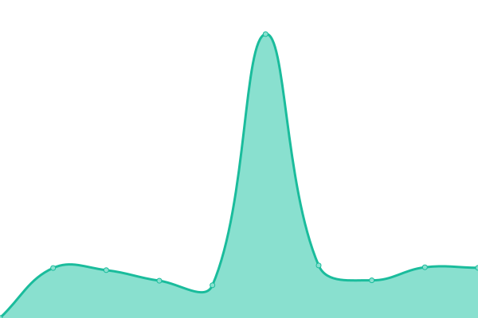

# [📈 Live Status](https://apps.status.ambler.kr): <!--live status--> **🟩 All systems operational**

This repository contains the open-source uptime monitor and status page for [Ambler](https://ambler.kr), powered by [Upptime](https://github.com/upptime/upptime).

With [Upptime](https://upptime.js.org), you can get your own unlimited and free uptime monitor and status page, powered entirely by a GitHub repository. We use [Issues](https://github.com/amblerkr/apps.status/issues) as incident reports, [Actions](https://github.com/amblerkr/apps.status/actions) as uptime monitors, and [Pages](https://apps.status.ambler.kr) for the status page.

<!--start: status pages-->
<!-- This summary is generated by Upptime (https://github.com/upptime/upptime) -->
<!-- Do not edit this manually, your changes will be overwritten -->
<!-- prettier-ignore -->
| URL | Status | History | Response Time | Uptime |
| --- | ------ | ------- | ------------- | ------ |
|  [svg-to-png.ambler.kr](https://svg-to-png.ambler.kr/) | 🟩 Up | [svg-to-png-ambler-kr.yml](https://github.com/amblerkr/apps.status/commits/HEAD/history/svg-to-png-ambler-kr.yml) | 

 233ms
     
 | 

<a href="https://apps.status.ambler.kr/history/svg-to-png-ambler-kr">100.00%</a>
    

|  [notion-widgets.ambler.kr](https://notion-widgets.ambler.kr/) | 🟩 Up | [notion-widgets-ambler-kr.yml](https://github.com/amblerkr/apps.status/commits/HEAD/history/notion-widgets-ambler-kr.yml) | 

 209ms
     
 | 

<a href="https://apps.status.ambler.kr/history/notion-widgets-ambler-kr">100.00%</a>
    

|  [discord-ifttt.ambler.kr](https://discord-ifttt.ambler.kr/) | 🟩 Up | [discord-ifttt-ambler-kr.yml](https://github.com/amblerkr/apps.status/commits/HEAD/history/discord-ifttt-ambler-kr.yml) | 

 321ms
     
 | 

<a href="https://apps.status.ambler.kr/history/discord-ifttt-ambler-kr">100.00%</a>
    

|  [calendar-svg.ambler.kr](https://calendar-svg.ambler.kr/) | 🟩 Up | [calendar-svg-ambler-kr.yml](https://github.com/amblerkr/apps.status/commits/HEAD/history/calendar-svg-ambler-kr.yml) | 

 178ms
     
 | 

<a href="https://apps.status.ambler.kr/history/calendar-svg-ambler-kr">100.00%</a>
    

|  [github-readme-stats.ambler.kr](https://github-readme-stats.ambler.kr/api?username=amblerkr) | 🟩 Up | [github-readme-stats-ambler-kr.yml](https://github.com/amblerkr/apps.status/commits/HEAD/history/github-readme-stats-ambler-kr.yml) | 

 1231ms
     
 | 

<a href="https://apps.status.ambler.kr/history/github-readme-stats-ambler-kr">100.00%</a>
    

|  [rsshub.ambler.kr](https://rsshub.ambler.kr/) | 🟩 Up | [rsshub-ambler-kr.yml](https://github.com/amblerkr/apps.status/commits/HEAD/history/rsshub-ambler-kr.yml) | 

 876ms
     
 | 

<a href="https://apps.status.ambler.kr/history/rsshub-ambler-kr">100.00%</a>
    

<!--end: status pages-->

[**Visit our status website →**](https://apps.status.ambler.kr)

## 📄 License

- Powered by: [Upptime](https://github.com/upptime/upptime)
- Code: [MIT](./LICENSE) © [Ambler](https://ambler.kr)
- Data in the `./history` directory: [Open Database License](https://opendatacommons.org/licenses/odbl/1-0/)
